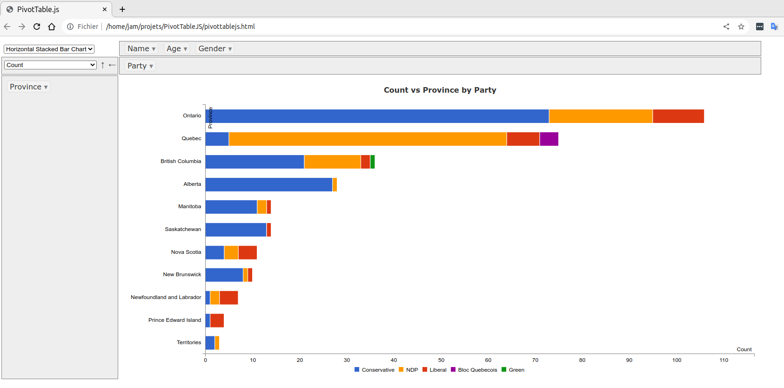

# Pivot_js  
  
[Pivot.js Projet Repository]('https://rwjblue.github.io/pivot.js/')  

```JavaScript Pivot table``` ou Le tableau croisé dynamique est un composant efficace qui permet de visualiser et d'agréger de gros volumes de données. C'est un excellent outil qui permet de générer des rapports sans avoir à utiliser des technologies côté serveur.  

  
